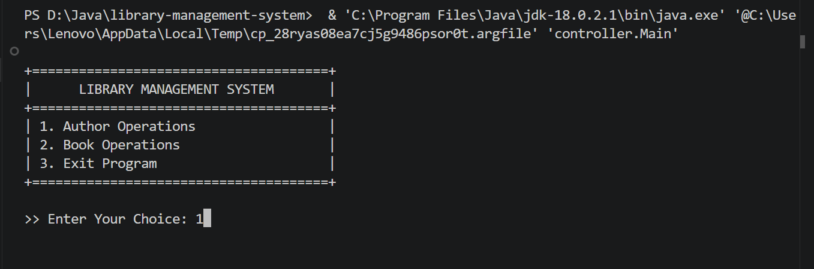
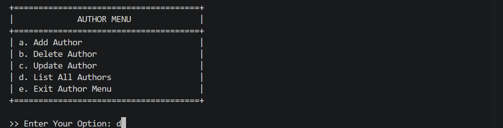
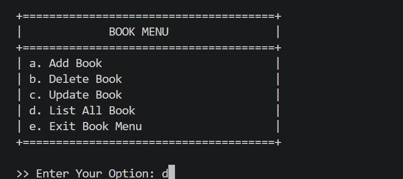
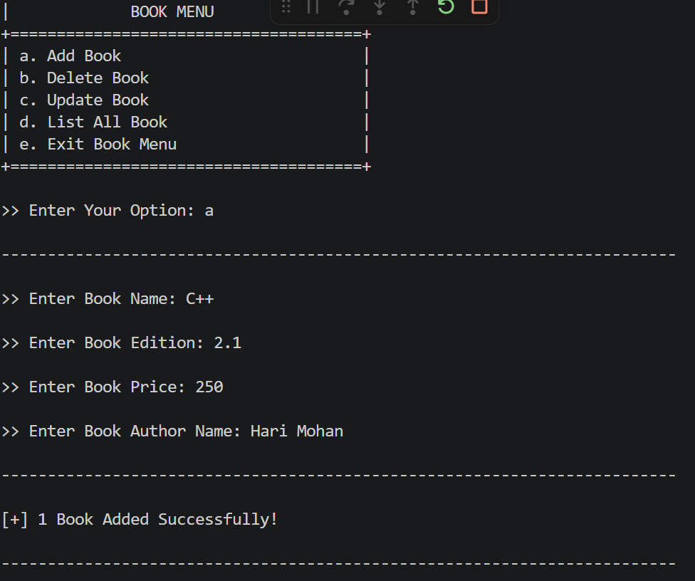
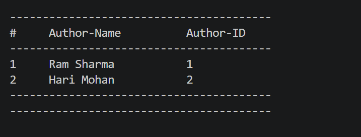
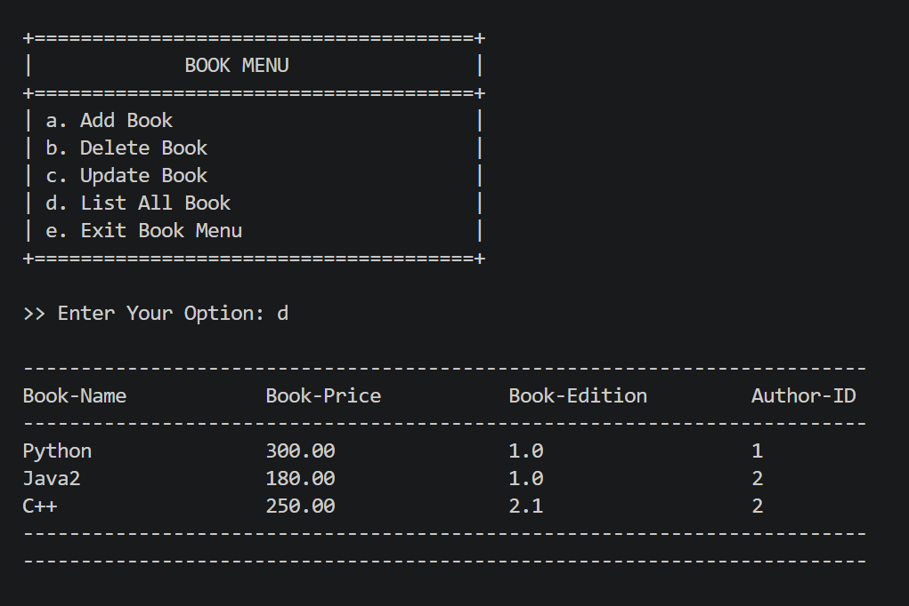

# Library Management System

A console-based Library Management System built using Core Java and JDBC with MySQL database connectivity.

The application lets you manage authors and books through a simple menu-driven console interface.

---

## Features

* Add Author
* View All Authors
* Add Book
* Delete Book
* Update Book
* View All Books
* Search Author By Name
* Custom Exception Handling
* JDBC Database Connectivity
* Console-based Menu System

---

## Technologies Used

* Core Java
* JDBC
* MySQL
* VS Code

---

## Project Structure

```text
src/
├── controller
├── dao
├── Exceptions
├── model
├── services
└── utils
```

---

## Database Details

**Database Name:** `library_db`

**Tables:**

* `author_tb`
* `book_tb`

---

## How to Run

1. Create the database using `library_db.sql`
2. Open the project in VS Code
3. Configure MySQL username and password in `DbConnection.java`
4. Run `Main.java`

---

## Screenshots

### Main Menu



### Author Menu



### Book Menu



### Add Book



### View All Authors



### View All Books



---

## Learning Outcomes

This project helped in understanding:

* JDBC Connectivity
* CRUD Operations
* Exception Handling
* Layered Architecture
* SQL Queries
* Java Console Application Development

---

## Author

**Mukul Dixit**

---

## Notes

* Make sure MySQL is running before starting the application.
* Update database credentials in `DbConnection.java` according to your system.
